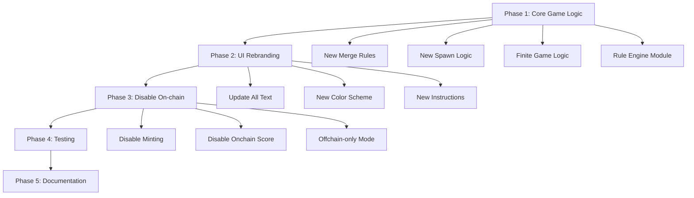

# Badge Threes Off-chain Implementation Plan

## Architecture Overview




---

## Phase 1: Core Game Mechanics Transformation ✅ (Complete)

**Implementation status (completed):**

- **1.1 Rule engine:** Created `lib/game/rules/types.ts`, `mergeRule.ts` (canMerge, getMergedValue), `spawnRule.ts` (getSpawnValue with weights 1:0.4, 2:0.4, 3:0.2).
- **1.2 Core logic:** Updated `merge.ts` to use canMerge/getMergedValue; `spawn.ts` to use getSpawnValue(SPAWN_WEIGHTS); `checkGameOver.ts` to use canMerge; `constants.ts` (SPAWN_WEIGHTS, removed SPAWN_2/4_PROBABILITY); `types.ts` (comments for Threes).
- **1.3 Unit tests:** Updated `merge.test.ts`, `spawn.test.ts`, `checkGameOver.test.ts`, `slide.test.ts`, `reducer.test.ts` for Threes rules; added `lib/game/rules/mergeRule.test.ts` and `spawnRule.test.ts`. All 141 tests pass.

**Phase 2: UI/UX Rebranding** completed (text, tile colors, instructions).

---

### 1.1 Create Rule Engine Module

**New files to create:**

- `lib/game/rules/mergeRule.ts` — Implements Threes merge logic
- `lib/game/rules/spawnRule.ts` — Implements Threes spawn logic
- `lib/game/rules/types.ts` — Rule engine types

**Merge Rule Implementation (Power-of-3):**

According to PRD:

- 1 + 2 → 3
- 3 + 3 → 6
- 6 + 6 → 12
- n + n → n × 2 (where n is divisible by 3 and n ≥ 3)

Current Badge2048 implementation in `lib/game/merge.ts`:

- Always merges identical tiles: n + n → 2n

**Changes needed:**

1. Create `canMerge(a: number, b: number): boolean` function
  - Returns true if tiles can merge according to Threes rules
  - Special case: 1 + 2 or 2 + 1 → 3
  - General case: identical tiles where value ≥ 3 and divisible by 3
2. Create `getMergedValue(a: number, b: number): number` function
  - Returns merged value according to rules
3. Refactor `mergeTiles()` to use new rule functions

**Spawn Rule Implementation:**

Current Badge2048 spawns 2 (90%) or 4 (10%).

Badge Threes should spawn 1, 2, or 3 with weighted probabilities.

**Changes needed:**

1. Create `getSpawnValue(): number` function
  - Returns 1, 2, or 3 based on weighted probabilities
  - Suggested weights (can be tuned):
    - 1: 40%
    - 2: 40%
    - 3: 20%
2. Update `spawnTile()` in `lib/game/spawn.ts` to use new rule

### 1.2 Update Core Game Logic

**Files to modify:**

`**lib/game/merge.ts**` (lines 15-40)

- Replace hardcoded `tile * 2` merge logic with rule-based merging
- Update `mergeTiles()` to call `canMerge()` and `getMergedValue()`
- Keep score calculation logic (sum of merged values)

`**lib/game/spawn.ts**` (lines 10-25)

- Replace `SPAWN_2_PROBABILITY` logic with `getSpawnValue()` from rule engine
- Keep random empty cell selection logic

`**lib/game/constants.ts**` (lines 15-16)

- Remove `SPAWN_2_PROBABILITY` constant
- Add new constants:
  - `SPAWN_WEIGHTS = { 1: 0.4, 2: 0.4, 3: 0.2 }` (tunable)
  - Update badge thresholds if needed (TBD based on Threes scoring)

`**lib/game/checkGameOver.ts**` (entire file)

- Update game over logic to use new merge rules
- Check adjacent tiles with `canMerge()` instead of equality check
- Keep "no empty cells" condition

### 1.3 Update Game State Types

`**lib/game/types.ts**` (lines 1-20)

- Types should remain mostly same
- Tile values now: `1 | 2 | 3 | 6 | 12 | 24 | 48 | ... | null`
- Update comments to reflect Threes mechanics
- Consider adding `GameVariant` type for future extensibility

---

## Phase 2: UI/UX Rebranding ✅ (Complete)

### 2.1 Update All Text References

**Files with "2048" or "Badge2048" references:**

`**app/page.tsx**` (lines 5, 14, 17)

- Metadata title: "Badge Threes - Home"
- Heading: "Welcome to Badge Threes"
- Description: Update to mention "Power-of-3" or "Threes" mechanics

`**app/layout.tsx**` (lines 20-21)

- Metadata title: "Badge Threes - Play & Earn Badges"
- Description: Update game description

`**app/play/page.tsx**` (lines 5, 13-14)

- Metadata title: "Badge Threes - Play"
- Heading: "Threes Badge Game"
- Description: Update to explain Threes rules

`**components/ui/navigation.tsx**` (line 35)

- Brand name: "Badge Threes"

`**components/game/Game.tsx**` (lines 302, 369, 546)

- Line 302: Keep "Badge unlocked" (generic)
- Line 369: Update hint text to reflect Threes rules
- Line 546: Update instructions:
  - Old: "Combine tiles with the same number to reach 2048!"
  - New: "Combine 1+2 to make 3, then merge pairs (3+3→6, 6+6→12) to reach higher scores!"

`**components/game/GameBoard.tsx**` (line 39)

- `aria-label="Badge Threes game board"`

### 2.2 Update Color Scheme & Styling

`**components/game/Tile.tsx**` (lines 20-50)

- Current: Stacks orange gradient (2→4→8→...→2048)
- New: Adjust color progression for Threes values (1, 2, 3, 6, 12, 24, ...)
- Suggested approach:
  - Tile 1: Light color (e.g., soft blue)
  - Tile 2: Different light color (e.g., soft red)
  - Tile 3+: Gradient progression similar to current, but adjusted for new values
  - Keep visual distinction between 1, 2, and merged tiles (3+)

### 2.3 Update Help/Instructions

`**app/play/page.tsx**` or create new help modal

- Add clear explanation of Threes merge rules:
  - "Combine 1 and 2 to create 3"
  - "Merge identical tiles (3+3, 6+6, etc.) to double their value"
  - "Game ends when no more moves are possible"
- Add visual examples if possible (optional)

---

## Phase 3: Disable On-chain Features ✅ (Complete)

### 3.1 Feature Flag System

**New file to create:**

- `lib/featureFlags.ts` — Centralized feature flag configuration

```typescript
export const FEATURES = {
  ONCHAIN_ENABLED: false,  // Set to false for off-chain phase
  BADGE_MINTING: false,
  ONCHAIN_SCORE_SUBMISSION: false,
  WALLET_REQUIRED: false,
} as const;
```

### 3.2 Disable Badge Minting

`**app/claim/page.tsx**` and `**components/badge/ClaimGrid.tsx**`

- Add feature flag check before showing "Claim" functionality
- If `FEATURES.BADGE_MINTING === false`:
  - Show "Coming Soon" or "Off-chain Mode" message
  - Disable claim buttons
  - Keep badge display for visual reference

`**hooks/useBadgeContract.ts**`

- Wrap `mintBadge()` calls with feature flag check
- Return early with error message if minting disabled

### 3.3 Disable On-chain Score Submission

`**hooks/useSubmitScore.ts**`

- Force `submitOnchain: false` if `FEATURES.ONCHAIN_SCORE_SUBMISSION === false`
- Keep off-chain leaderboard submission active

`**components/game/Game.tsx**` (Game Over flow)

- Remove on-chain score submission UI if feature disabled
- Keep local high score tracking (localStorage)
- Keep off-chain leaderboard submission

### 3.4 Simplify Wallet Integration

`**components/ui/wallet-connect.tsx**`

- If `FEATURES.WALLET_REQUIRED === false`:
  - Hide wallet connect button or show "Not Required" state
  - Keep component structure for future re-enable

`**app/layout.tsx**` and `**components/providers/StacksProvider.tsx**`

- Keep StacksProvider but skip initialization if wallet not required
- This allows easy re-enable for testnet phase

### 3.5 Update API Routes

**Keep functional but handle gracefully:**

- `/api/badge-ownership` — Return empty/mock data if contract not deployed
- `/api/leaderboard` — Keep fully functional (off-chain store)
- `/api/leaderboard/sync` — Disable or return early if on-chain disabled

Add health check in `/api/health` to report feature flag status.

---

## Phase 4: Testing & Validation

### 4.1 Update Unit Tests

`**lib/game/merge.test.ts**`

- Replace all 2048 merge tests with Threes merge tests
- Test cases:
  - `1 + 2 = 3`
  - `2 + 1 = 3`
  - `3 + 3 = 6`
  - `6 + 6 = 12`
  - `1 + 1 = no merge`
  - `2 + 2 = no merge`
  - Multiple merges in one row

`**lib/game/spawn.test.ts**`

- Update tests to expect 1, 2, or 3 spawns
- Test spawn probability distribution (statistical test)

`**lib/game/checkGameOver.test.ts**`

- Update tests to use Threes merge rules
- Test finite game end scenarios:
  - Full board with no valid merges
  - Board with merges available (not game over)

`**lib/game/slide.test.ts**`

- Update slide tests to use Threes merge logic
- Test all 4 directions with new rules

`**lib/game/reducer.test.ts**`

- Update integration tests for full game flow
- Test initial state (should spawn 2 tiles with values 1, 2, or 3)
- Test game over detection

### 4.2 Create New Rule Engine Tests

**New test file:**

- `lib/game/rules/mergeRule.test.ts` — Test all merge rule cases
- `lib/game/rules/spawnRule.test.ts` — Test spawn logic

### 4.3 Manual Testing Checklist

1. **Game Start**
  - Board spawns 2 tiles (values 1, 2, or 3)
  - Tiles are in random positions
2. **Merge Mechanics**
  - 1 + 2 = 3 (both directions)
  - 3 + 3 = 6
  - 6 + 6 = 12
  - Continue to higher values (24, 48, 96, ...)
  - Non-matching tiles don't merge
3. **Tile Spawning**
  - New tile (1, 2, or 3) spawns after valid move
  - No spawn if board didn't change
  - No spawn if board is full
4. **Game Over**
  - Game ends when board is full AND no valid merges
  - Score is final and displayed
  - "Play Again" button restarts game
5. **Score Tracking**
  - Score increases correctly on each merge
  - High score saved to localStorage
  - Leaderboard submission works (off-chain)
6. **UI/UX**
  - All text references updated (no "2048" mentions)
  - Tile colors match new values
  - Instructions are clear
  - Animations work smoothly
7. **Off-chain Verification**
  - No wallet connection required
  - No on-chain transactions attempted
  - Badge claim page shows "off-chain mode" state
  - Leaderboard works without wallet

### 4.4 Update E2E Tests

`**e2e/play.spec.ts**`

- Update game interaction tests for Threes rules
- Test merge sequences specific to Threes
- Verify game over conditions

`**e2e/badge-claim.spec.ts**`

- Update to expect "off-chain mode" or disabled state
- Skip minting tests for off-chain phase

`**e2e/leaderboard.spec.ts**`

- Keep tests as-is (should work off-chain)
- Verify no wallet requirement

---

## Phase 5: Documentation & Configuration

### 5.1 Update Documentation

`**README.md**`

- Update project name and description
- Replace "Badge2048" with "Badge Threes"
- Add section explaining Threes merge rules
- Update setup instructions
- Add note about off-chain phase

`**docs/GAME-MECHANICS.md**`

- Rewrite to explain Threes merge rules
- Remove 2048 references
- Add diagrams/examples of valid merges

`**docs/badge-three-prd.md**`

- Keep as reference (already exists)
- Add implementation status section

**New documentation needed:**

- `docs/OFFCHAIN-PHASE.md` — Explain off-chain mode, what's disabled, roadmap to testnet/mainnet
- `docs/THREES-RULES.md` — Detailed game rules reference

**Update existing docs:**

- `docs/BADGE-SYSTEM.md` — Note that badges are display-only in off-chain phase
- `docs/CLAIM-FLOW.md` — Update for off-chain mode
- `docs/MVP-SCOPE.md` — Update scope for Threes off-chain phase

### 5.2 Update Configuration Files

`**package.json**`

- Update `name`: `"badge-threes"`
- Update `description`: Reference Threes mechanics
- Update `version`: `"0.1.0"` (new project start)

`**.env.example**`

- Add comment: "On-chain features disabled for off-chain phase"
- Keep Stacks config but mark as optional/future

`**next.config.ts**`

- Keep as-is (no changes needed)

### 5.3 Update Assets & Metadata

`**public/` folder**

- Rename or replace `badge2048-stacks-icon.png` with new Badge Threes icon
- Update favicon (`app/icon.png`)
- Create new icon with "3" or "Threes" branding

`**app/layout.tsx**` metadata

- Update OpenGraph images/descriptions
- Update site name throughout

**Phase 5 implementation status:** Complete. All documentation updated (README, GAME-MECHANICS, THREES-RULES, OFFCHAIN-PHASE, BADGE-SYSTEM, CLAIM-FLOW, MVP-SCOPE, badge-three-prd implementation status); package.json and .env.example updated; manual testing checklist signed off (2025-02-05). Icon/favicon refresh remains optional (see docs/OFFCHAIN-PHASE.md).

---

## Implementation Order & Dependencies

### Phase 1: Core Game Logic (Priority: Critical)

1. Create rule engine module (`lib/game/rules/`)
2. Update `merge.ts` to use new rules
3. Update `spawn.ts` to use new rules
4. Update `checkGameOver.ts` for new rules
5. Update `constants.ts`
6. Run and fix unit tests

**Estimated Complexity:** High (core game mechanics)
**Blockers:** None

---

### Phase 2: UI Rebranding (Priority: High)

1. Update all text references across app
2. Update tile color scheme
3. Update instructions/help text
4. Update navigation and metadata

**Estimated Complexity:** Medium (search-and-replace + styling)
**Blockers:** None (can run parallel with Phase 1)

---

### Phase 3: Disable On-chain (Priority: High)

1. Create feature flag system
2. Disable badge minting UI
3. Disable on-chain score submission
4. Update wallet integration
5. Update API routes for graceful degradation

**Estimated Complexity:** Medium
**Blockers:** Depends on Phase 2 completion

---

### Phase 4: Testing (Priority: Critical)

1. Update all unit tests
2. Create rule engine tests
3. Manual testing checklist
4. Update E2E tests

**Estimated Complexity:** High (comprehensive testing)
**Blockers:** Depends on Phase 1-3 completion

---

### Phase 5: Documentation (Priority: Medium)

1. Update README
2. Update existing docs
3. Create new docs (OFFCHAIN-PHASE.md, THREES-RULES.md)
4. Update package.json and assets

**Estimated Complexity:** Low
**Blockers:** Can start during Phase 4

---

## Key Files Reference

### Core Game Logic (Phase 1)

- `lib/game/merge.ts` — Update merge logic
- `lib/game/spawn.ts` — Update spawn logic
- `lib/game/checkGameOver.ts` — Update game over check
- `lib/game/constants.ts` — Update constants
- `lib/game/rules/mergeRule.ts` — NEW: Rule engine
- `lib/game/rules/spawnRule.ts` — NEW: Spawn rules
- `lib/game/rules/types.ts` — NEW: Rule types

### UI Components (Phase 2)

- `app/page.tsx` — Homepage text
- `app/layout.tsx` — Metadata
- `app/play/page.tsx` — Play page text
- `components/game/Game.tsx` — Game instructions
- `components/game/Tile.tsx` — Tile colors
- `components/game/GameBoard.tsx` — ARIA labels
- `components/ui/navigation.tsx` — Brand name

### Feature Flags (Phase 3)

- `lib/featureFlags.ts` — NEW: Feature flags
- `hooks/useBadgeContract.ts` — Disable minting
- `hooks/useSubmitScore.ts` — Disable on-chain score
- `app/claim/page.tsx` — Disable claim UI
- `components/ui/wallet-connect.tsx` — Optional wallet

### Tests (Phase 4)

- `lib/game/merge.test.ts` — Update tests
- `lib/game/spawn.test.ts` — Update tests
- `lib/game/checkGameOver.test.ts` — Update tests
- `lib/game/slide.test.ts` — Update tests
- `lib/game/reducer.test.ts` — Update tests
- `lib/game/rules/mergeRule.test.ts` — NEW: Rule tests
- `e2e/play.spec.ts` — Update E2E tests

### Documentation (Phase 5)

- `README.md` — Update
- `docs/GAME-MECHANICS.md` — Rewrite
- `docs/OFFCHAIN-PHASE.md` — NEW
- `docs/THREES-RULES.md` — NEW
- `package.json` — Update metadata

---

## Success Criteria

- ✅ Game mechanics follow Threes rules (1+2→3, 3+3→6, etc.)
- ✅ Game ends when no valid moves remain (finite gameplay)
- ✅ Tiles spawn with values 1, 2, or 3
- ✅ All UI text references "Badge Threes" (no "2048")
- ✅ Tile colors match new value progression
- ✅ All unit tests pass with new rules
- ✅ Manual testing checklist completed
- ✅ E2E tests updated and passing
- ✅ On-chain features disabled (no wallet required)
- ✅ Off-chain leaderboard functional
- ✅ Documentation updated
- ✅ Game is playable, fun, and distinct from 2048

---

## Future Phases (Post-Implementation)

After off-chain phase is complete and validated:

1. **Testnet Phase** — Re-enable on-chain features, deploy contract to testnet
2. **Mainnet Phase** — Deploy to Stacks mainnet after testnet validation
3. **Deploy** — Production deployment with full on-chain integration

These phases will require:

- New Clarity contract for Badge Threes
- Updated badge thresholds/metadata
- Testnet/mainnet deployment scripts
- Updated contract integration code

